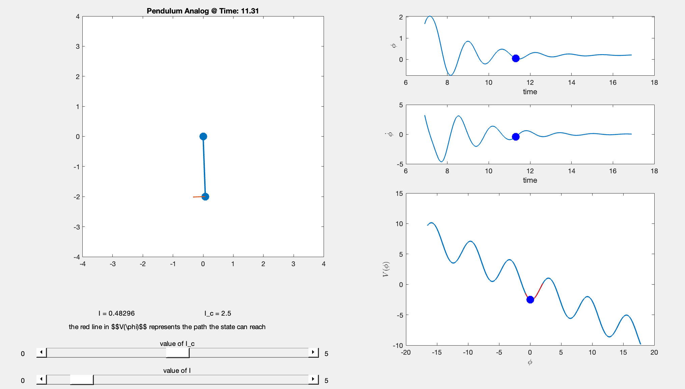

# RCSJ Washboard Potential

This script was made for 6.s079 - Classical and Quantum Superconducting Circuits taught in Fall 2020.
The script is a solver for the RCSJ model of a superconducting josephson junction. It helps visualize
applications of different currents vs. the critical current and how the washboard potential tilts.

The model shows a pendulum analog, where force is related to the current applied and the
pendulum properties correspond to the model constants. 

The mechanical analog for the model is as follows:

Where the moment of inertia is related to the capacitance term as

, the damping coefficient as 

and an analog between the applied torque to driving current, where 
, 
and

